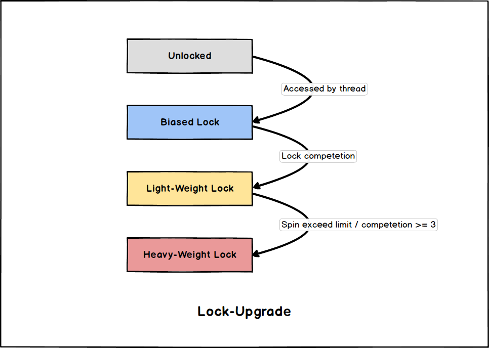

# JVM-Synchronized

- [JVM-Synchronized](#jvm-synchronized)
  - [Synchronized的使用](#synchronized的使用)
  - [锁的升级](#锁的升级)
    - [无锁](#无锁)
    - [偏向锁](#偏向锁)
    - [轻量级锁](#轻量级锁)
    - [重量级锁](#重量级锁)

## Synchronized的使用

`synchronized` 关键字使用很简单, **重点是需要搞清楚锁的对象是谁**, 这里简单带过:

- 对于普通的 `synchronized` 方法: **锁** 是当前实例对象。

  ```java
  synchronized void fooMethod() { /* ... */ }
  ```

- 对于静态的 `synchronized` 方法: **锁** 是当前实例的 `Class` 对象。

  ```java
  synchronized static void fooStaticMethod() { /* ... */ }
  ```

- 对于 `synchronized` 块: **锁** 是 `synchronized` 后括号中指定的对象。

  ```java
  synchronized (fooObj) { /* ... */ }
  ```

## 锁的升级

***JDK1.6*** 以前所有通过 `synchronized` 来进行同步的代码, 都是通过 *OS* 级别的互斥锁实现的, 因为存在上下文切换, 开销很大。

***JDK1.6*** 之后引入了 **锁升级机制**, 大幅度提升了 `synchronized` 的性能。



### 无锁

- [ ] TODO

### 偏向锁

- [ ] TODO

### 轻量级锁

- [ ] TODO

### 重量级锁

- [ ] TODO
