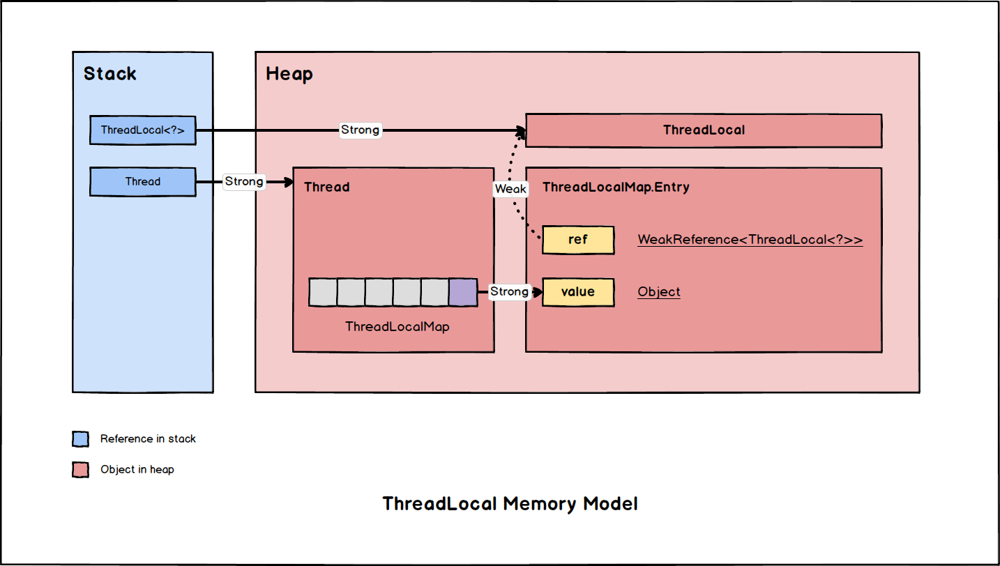

# ThreadLocal

保证多线程同步有很多种不同的方案:

- 同步
  - 互斥同步: 互斥锁, 如 `synchronized`, `ReentrantLock`。
  - 非阻塞同步: 轻量级锁, 如 `CAS`, `Atomic-XXX`。
- 无同步
  - 拷贝: 栈封闭, **每个线程持有单独的拷贝**, 不共享。

> `ThreadLocal` 的思想就是为每一个线程单独拷贝一份副本。

- [ThreadLocal](#threadlocal)
  - [如何使用](#如何使用)
  - [工作原理](#工作原理)
  - [为什么是弱引用](#为什么是弱引用)
  - [内存泄漏问题](#内存泄漏问题)

## 如何使用

一般将 `ThreadLocal<?>` 声明为 `static` 变量, 然后在线程中通过其引用获取相应线程中对应的值。

主要方法:

| Method                       | Description                                                                                        |
| ---------------------------- | -------------------------------------------------------------------------------------------------- |
| `public T get()`             | 获取对应 `ThreadLocal` 的值                                                                        |
| `public void set(T value)`   | 设置对应 `ThreadLocal` 的值                                                                        |
| `public void remove()`       | 移除对应 `ThreadLocal` 的值, 同时清除当前线程下 `ThreadLocalMap` 中对应的的 `Entry` (Since JDK1.5) |
| `protected T initialValue()` | 用于重写以提供默认值, JDK8 以后可以通过静态方法 `ThreadLocal.withInitial` 直接设置默认值           |

*Example*:

```java
class Foo {
  // declare as static in the class.
  private static final Supplier<?> initialSupplier = ...
  private static final ThreadLocal<?> myThreadLocal = ThreadLocal.withInitial(initialSupplier);

  public static void main(String[] args) {
    new Thread(() -> { // then use the variable inside a thread.
      myThreadLocal.set(...);
      myThreadLocal.get();
      myThreadLocal.remove();
      // other operations ...
    }).start();
  }
}
```

> 默认值的设定可以通过静态方法 `withInitial()` 直接提供, 也可以继承 `ThreadLocal` 然后重写 `initialValue()`。

## 工作原理

用户在使用的时候仅仅看到的是一个栈上的 `ThreadLocal<?>` 引用, 然而在通过其进行如 `get()` / `set()` 等操作时, 会先通过 `Thread.currentThread()` 的引用找到当前线程下一个叫做 `ThreadLocalMap` 的数据结构, 其 `key` 为该 `ThreadLocal<?>` 的引用变量, 值为当前线程下该变量的值。



> 本质上就是每个 `Thread` 自己维护一张 `ThreadLocalMap` 然后每个线程的值就能够拥有自己的独立拷贝了。

## 为什么是弱引用

可以注意到 `ThreadLocalMap.Entry` 中的 `ref` 是一个 [弱引用(Weak-Reference)](../Jvm/MM-Reference-Types.md#弱引用weak-reference), 这里为什么要采用弱引用而不是一个常规的 [强引用(Strong-Reference)](../Jvm/MM-Reference-Types.md#强引用strong-reference)?

因为当栈中的 `ThreadLocal<?>` 不再指向堆中对象的时候, 如果上面提到的引用是强引用, 则对应的对象仍然得不到释放, 除非整个 `Thread` 对象被回收, 相关引用链全部被回收, 这里存在潜在的内存泄漏风险, 因此采用 [弱引用](../JMM/Reference.md#弱引用weak-reference) 来保证当栈上的 `ThreadLocal<?>`
不在引用的时候就能够释放堆中对象。

## 内存泄漏问题

虽然上面提到的 `Weak-Reference` 的使用减少了内存泄露的可能性, 但 **`ThreadLocal` 仍然存在内存泄露的可能性**。

- 什么时候会内存泄漏?

  线程池和 `ThreadLocal` 结合使用的时候就有可能导致内存泄漏, 因为 `Thread` 能够一直存活。

  线程对象一直存活, 其中的 `ThreadLocalMap` 也会一直存活, 因此会一直有一个指向 `Entry` 中 `value` 属性的 **强引用**, 从而导致 `Entry` 对象发生内存泄漏。

  > 但即使存在, 这种 **内存泄漏** 大多数情况下也不会过于严重。`(泄露的内存 = 核心线程数 * value对象的大小)`

- 如何预防潜在的内存泄漏?

  通过上面的分析, 我们可以发现, **内存泄漏** 的根本原因是 `ThreadLocalMap` 中的 `Entry` 一直存在。那么解决方案就很简单了, 只要我们想办法使对应的 `Entry` 在不再使用的时候能被清理掉就可以了。

  使用 `ThreadLocal.remove()` 即可清除掉当前线程下 `ThreadLocalMap` 中对应的 `Entry`。

  ```java
  public void remove() { // ThreadLocal.remove()
    ThreadLocalMap m = getMap(Thread.currentThread());
    if (m != null) {
        m.remove(this);
    }
  }
  ```
