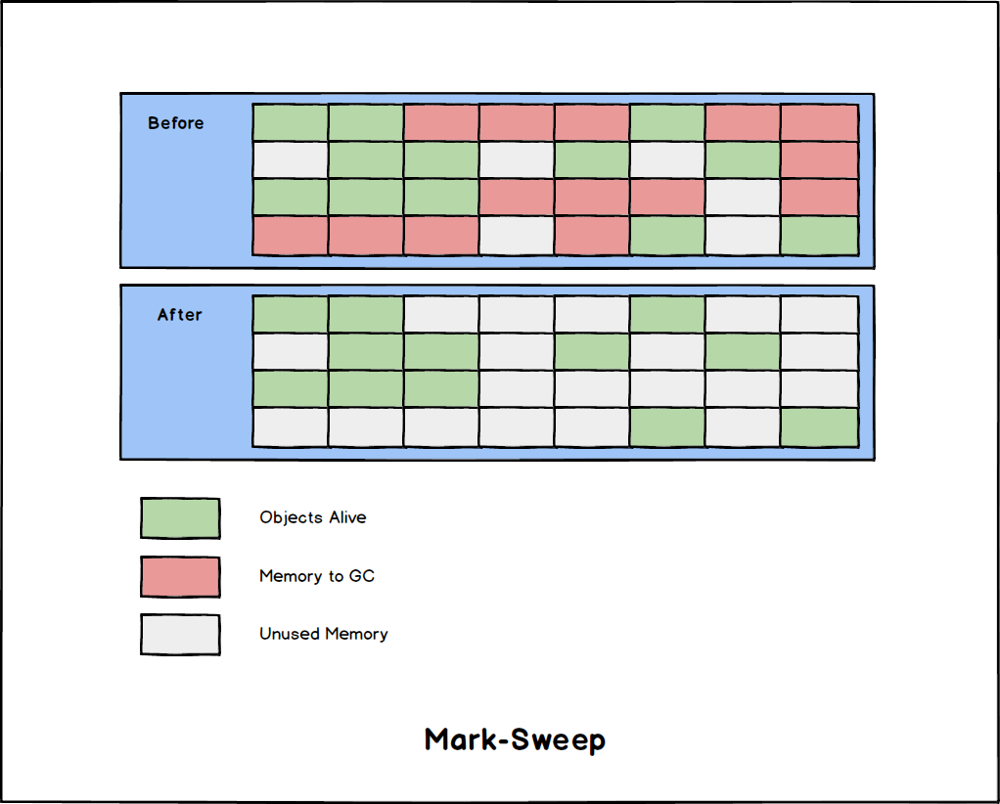
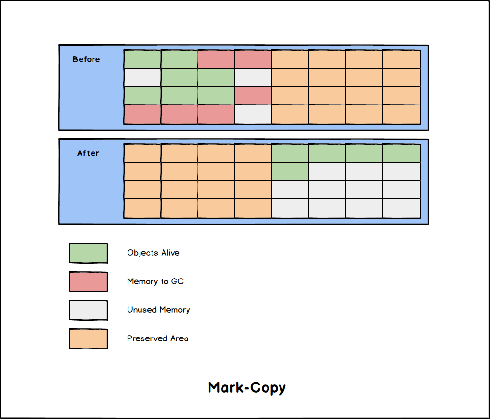
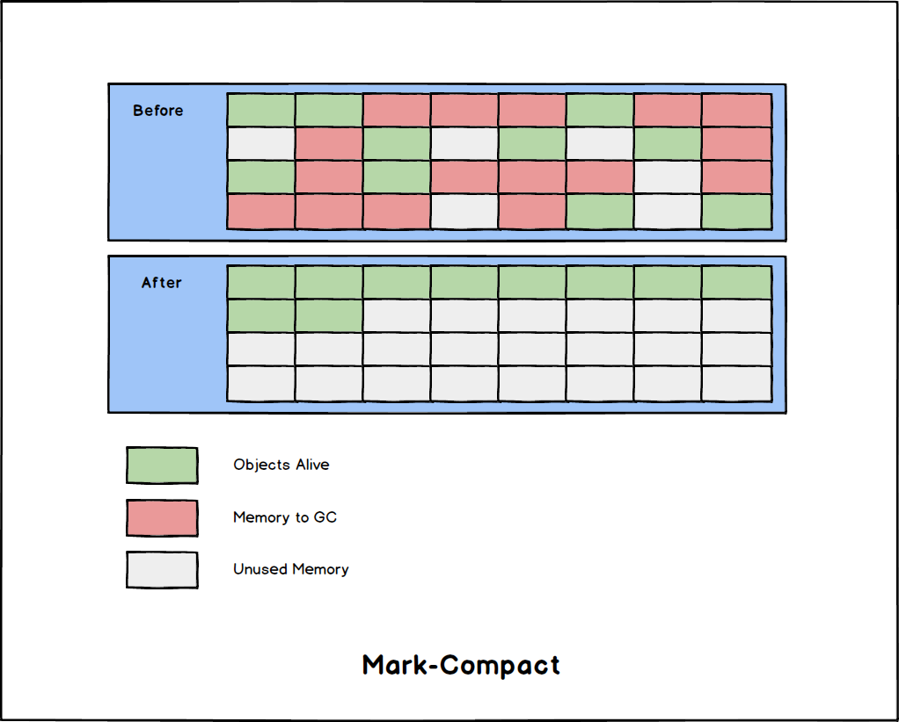

# JVM垃圾回收算法-GC-Algorithms

- [JVM垃圾回收算法-GC-Algorithms](#jvm垃圾回收算法-gc-algorithms)
  - [分代收集理论-Generational-Collection-Theory](#分代收集理论-generational-collection-theory)
  - [标记-清除-Mark-Sweep](#标记-清除-mark-sweep)
  - [标记-复制-Mark-Copy](#标记-复制-mark-copy)
  - [标记-整理-Mark-Compact](#标记-整理-mark-compact)

## 分代收集理论-Generational-Collection-Theory

传统的分代收集垃圾收集器建立在以下几个假说上:

| Hypothesis                                               | Concept                                    |
| -------------------------------------------------------- | ------------------------------------------ |
| 1. 弱分代假说(Weak-Generational-Hypothesis)              | 绝大多数的对象朝生夕灭                     |
| 2. 强分代假说(Strong-Generational-Hypothesis)            | 熬过越多次 *GC* 的对象就越难以消亡         |
| 3. 跨代引用假说(Inter-Generational-Reference-Hypothesis) | 跨代引用相对于同代引用来说仅占十分小的比例 |

基于 1, 2 两条假说, 分代垃圾收集器将 *Heap* 划分为不同的区域 (新生代, 老年代等), 然后对不同区域采取不同的策略进行回收。因此才有了 *"Minor GC"*, *"Major GC"*, *"Full GC"* 等概念的划分。

基于假说
3，在处理跨代引用的时候就不必扫描整个老年代，出现了 **记忆集(*Remembered-Set*)/卡表(*Card-Table*)** 等开销较低的方案。

> 分代收集理论也有其缺陷, 较新的垃圾收集器中都出现了面向全区域收集的理念, 或者支持面向全区域不分代的工作模式。

## 标记-清除-Mark-Sweep

***Mark-Sweep*** 是最早出现的, 也是最基础的垃圾回收算法, 后续算法大多以此为基础进行改进。

步骤:

1. 标记(Mark): 先标记出所有需要回收的对象。
2. 清除(Sweep): 原地回收所有被标记回收的对象。
3. 也可以反向实现为对存活的对象标记

存在的问题:

- 执行效率不稳定: 当有 *Heap* 上有仅有少部分对象存活时，标记和清理开销会很大。
- 内存空间碎片化: **原地清除** 会导致 *Heap* 空间不连续，留下大量碎片。

## 标记-复制-Mark-Copy

为了解决 [***Mark-Sweep***](#标记-清除-mark-sweep) 回收大量对象时效率低下以及内存碎片的问题, 出现了一种称为 **"半区复制"(*"Semi-Space-Copying"*)** 的解决方案。

***Mark-Copy*** 将 *Heap* 划分为两段空间，当进行 *GC* 的时候将存活的对象复制到另一半未使用的空间上, 然后对旧半区直接清除。

这种方式 **在每次存活少数对象时非常高效**, 也十分与新生代的 **"朝生夕灭"** 吻合。

- **Question: 每次对半分? 浪费空间是不是有点多了?**
  
  这里我们回顾一下分代假说中的 **弱分代假说(*Weak-Generational-Hypothesis*)**: "绝大多数的对象是朝生夕灭的。"
  
  其实 *HotSpot* 的策略就不是对半分: *HotSpot* 将新生代划分为 *Eden* 和 *Survivor* 两个区域，每次 *GC* 对 *Eden* 进行标记然后复制少数存活的新生代对象到 *Survivor* 上, *Eden* 和 *Survivor* 的区域划分比例达到了 ***8:1***
  
  > 当比例过于激进时 *Survivor* 就有可能面临空间不足的问题, 需要依赖额外空间作为内存担保(通常是老年代), 但有研究表明 ***98%*** 的新生代对象活不过第一轮 *GC*。

## 标记-整理-Mark-Compact

[***Mark-Copy***](#标记-复制-mark-copy) 十分适合新生代的 **"朝生夕灭"**, 但对于老年代存活率较高, 需要进行大量复制的情况下，效率不佳(且无法通过不对称划分来提升内存利用率)。

***Mark-Compact*** 与 ***Mark-Sweep*** 唯一的不同在于, ***Mark-Sweep*** 是 **原地** 清除, 而 ***Mark-Compact*** 会将对象向内存一端整理, 不产生碎片。

> 相比于 [***Mark-Sweep***](#标记-清除-mark-sweep), 该方式是移动式的, 因此需要花时间更新引用, 增加了 ***STW*** 的时间长度。 (因此 ***Mark-Compact*** 也并没有完胜 ***Mark-Sweep***。***Mark-Sweep*** 低延迟, ***Mark-Compact 高吞吐***)
>
> 因此也有一种 "和稀泥" 方案: 平时使用 ***Mark-Sweep***, 当内存碎片化到无法忍受时使用 ***Mark-Compact*** (***CMS-Collector***)。
