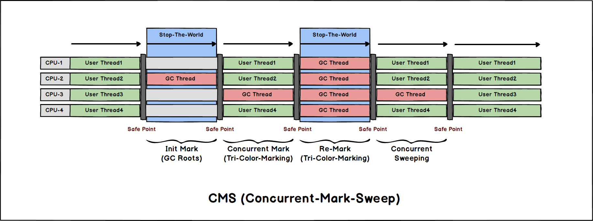

# JVM垃圾收集器-Garbage-Collectors

- [JVM垃圾收集器-Garbage-Collectors](#jvm垃圾收集器-garbage-collectors)
  - [新生代收集器](#新生代收集器)
    - [Serial](#serial)
    - [Par-New](#par-new)
    - [Parallel-Scavenger](#parallel-scavenger)
  - [老年代收集器](#老年代收集器)
    - [Serial-Old](#serial-old)
    - [Parallel-Old](#parallel-old)
    - [CMS-Concurrent-Mark-Sweep](#cms-concurrent-mark-sweep)
  - [跨代收集器](#跨代收集器)
    - [G1-Garbage-First](#g1-garbage-first)
  - [低延迟收集器](#低延迟收集器)
    - [Shenandoah](#shenandoah)
    - [ZGC](#zgc)

## 新生代收集器

### Serial

- *Serial* 收集器是最基础, 历史最久的收集器，用于 **新生代(*Young-Generation*)** 垃圾回收。

- *Serial* 收集器采用的是 [**标记-复制(*Mark-Copy*)算法**](./GC-Algorithms.md#标记-复制mark-copy)。

- 单线程, **全程停止所有用户线程** 进行收集(*STW*)。

![JVM-GC-Collector-[Serial+SerialOld]](../../.assets/JVM-GC-Collector-[Serial+SerialOld].png)

### Par-New

- *Par-New* 是 [*Serial*](#serial) 的并行版本, 也是一款 **新生代(*Young-Generation*)** 垃圾回收器。

- *Par-New* 收集器采用的是 [**标记-复制(*Mark-Copy*)算法**](./GC-Algorithms.md#标记-复制mark-copy)。

- 除了收集过程是多线程进行的, 其他的特性和回收算法都和 *Serial* 一致 (全程 *STW*)。

![JVM-GC-Collector-[ParNew+SerialOld]](../../.assets/JVM-GC-Collector-[ParNew+SerialOld].png)

### Parallel-Scavenger

- *Parallel-Scavenger* 收集器注重吞吐量而牺牲延迟, 是一款 **新生代(*Young-Generation*)** 垃圾回收器。

- *Parallel-Scavenger* 收集器采用的是 [**标记-复制(*Mark-Copy*)算法**](./GC-Algorithms.md#标记-复制mark-copy)。

- 和 [*Par-New*](#par-new) 很相似，仅仅是参数和搭配的选择上有一些不同 (全程 *STW*)。

![JVM-GC-Collector-[ParallelScavenger+ParallelOld]](../../.assets/JVM-GC-Collector-[ParallelScavenger+ParallelOld].png)

> [*Par-New*](#par-new) 能够与 [*CMS*](#cms-concurrent-mark-sweep) 搭配使用, *Parallel-Scavenger* 只能搭配 [*Parallel-Old*](#parallel-old) 作为老年代收集器, 因此Web应用下不怎么使用 *Parallel-Scavenger*。

## 老年代收集器

### Serial-Old

- *Serial-Old* 是 [*Serial*](#serial) 收集器的老年代版本，适用于 **老年代(*Old-Generation*)** 垃圾回收。

- *Serial-Old* 收集器采用的是 [**标记-整理(*Mark-Compact*)算法**](./GC-Algorithms.md#标记-整理mark-compact)。

- 单线程, 全程 *STW*。

![JVM-GC-Collector-[Serial+SerialOld]](../../.assets/JVM-GC-Collector-[Serial+SerialOld].png)

### Parallel-Old

- *Parallel-Old* 是 [Parallel-Scavenger](#parallel-scavenger) 的 **老年代(*Old-Generation*)** 版本。(注意不是 [*Par-New*](#par-new) !)

- *Parallel-Old* 收集器采用的是 [**标记-整理(*Mark-Compact*)算法**](./GC-Algorithms.md#标记-整理mark-compact)。

- 全程 *STW*

![JVM-GC-Collector-[ParallelScavenger+ParallelOld]](../../.assets/JVM-GC-Collector-[ParallelScavenger+ParallelOld].png)

### CMS-Concurrent-Mark-Sweep

- *CMS* 是一种追求低延迟的垃圾收集器。(减少 *STW* 时间占比, 但牺牲了吞吐量)

- *CMS* 采用的是 [**标记-整理(*Mark-Sweep*)算法**](./GC-Algorithms.md#标记-清除mark-sweep) + [**标记-整理(*Mark-Compact*)算法**](./GC-Algorithms.md#标记-整理mark-compact)。
(平时使用 *Mark-Sweep* 减少 *STW* 时间, 当碎片过多无连续内存分配新对象, 只能 *Full-GC* 的时候使用 *Mark-Compact* 整理碎片, 涉及到对象移动, 会引起 *STW*)

- *CMS* 的工作步骤:
  
  | Step                              | Task                                      | Concurrency    |
  | --------------------------------- | ----------------------------------------- | -------------- |
  | 1. 初始标记(CMS-Initial-Mark)     | 寻找 *GC-Roots* 能直接关联到的对象        | *STW*          |
  | 2. 并发标记(CMS-Concurrent-Mark)  | 查找引用链                                | 与用户线程并发 |
  | 3. 重新标记(CMS-Re-Mark)          | **三色标记法** 增量更新(确保没有"误回收") | *STW*          |
  | 4. 并发清除(CMS-Concurrent-Sweep) | 清除所有标记的无用对象                    | 与用户线程并发 |

**并发模式失败(*Concurrent-Mode-Failure*)**:

- *CMS* 由于和用户线程并发, 并不能等到老年代满了才开始进行 *GC*, 必须提前留出一部分安全空间提前开始回收(*JDK6* 以后默认为老年代占用达到 *92%* 则开始 *CMS* 回收)。

- 如果回收速率赶不上新生代对象晋升到老年代的速率, 老年代内存不足, 就会触发 **并发模式失败**, 这时候会尝试进行一次 *STW* 的 *Full-GC*, *CMS* 退化为 [*Serial-Old*](#serial-old)。

- 如果此情形经常发生应该考虑 扩大老年代区域大小 / 缩小 *CMS* 开始回收的阈值。

*CMS* 是 *JDK* 追求低延迟 *GC* 的第一次尝试, 减少了 *STW* 时间, 但也引入了一些额外的问题:

- **内存碎片**

  *CMS* 大多数时候使用 *Mark-Sweep* 算法来进行并发垃圾清除, 但 *Mark-Sweep* 算法容易导致内存碎片化。 *CMS* 仅会在触发 *Full-GC* 的时候采用 *Mark-Compact* 整理内存碎片。

- **浮动垃圾**

  *CMS* 使用 [**三色标记法(*Tri-Color-Marking*)**](./GC-Tri-Color-Marking.md) 进行并发垃圾回收, 由于三色标记法本身的问题, 可能存在 "浮动垃圾(*Floating-Garbage*)"。 (即有部分垃圾可能逃过回收)

- **高CPU占用**

  *CMS* 与用户线程并发, 会抢占部分 *CPU* 资源, 导致不稳定。

## 跨代收集器

### G1-Garbage-First

todo

## 低延迟收集器

### Shenandoah

todo

### ZGC

todo
