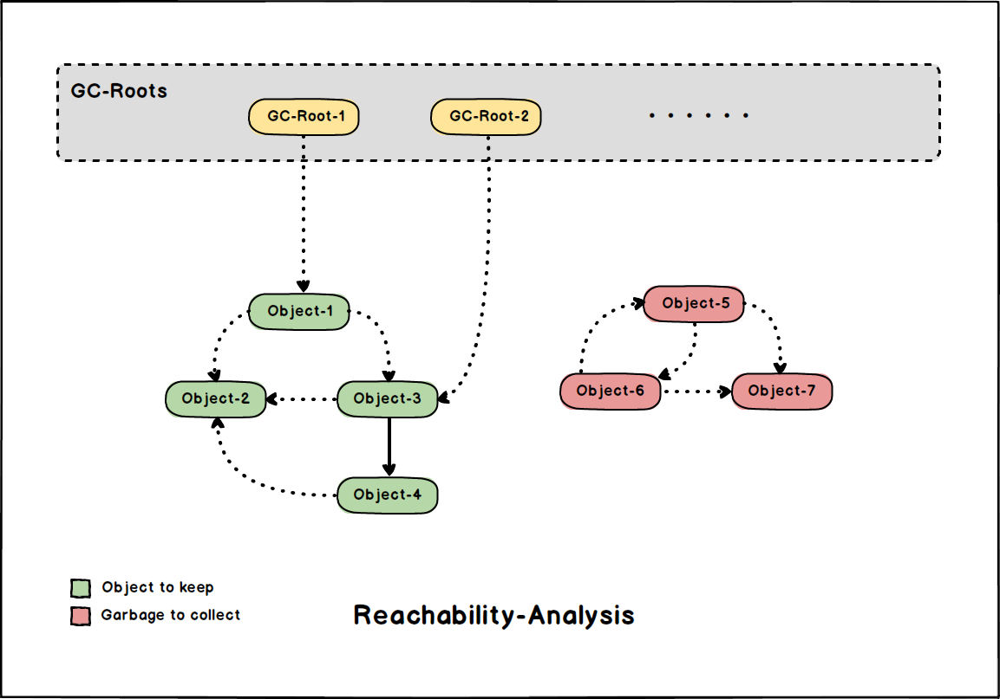

# 一些垃圾回收相关概念-GC-Concepts

这里介绍一些 *GC* 相关的概念, 并介绍 *JVM* 的 *GC* 属于哪一种类型。

> JVM 主要采用 可达性分析 + 准确式 GC

- [一些垃圾回收相关概念-GC-Concepts](#一些垃圾回收相关概念-gc-concepts)
  - [保守式与准确式GC](#保守式与准确式gc)
    - [保守式GC-Conservative-GC](#保守式gc-conservative-gc)
    - [准确式GC-Accurate-GC](#准确式gc-accurate-gc)
  - [可达性分析与引用计数](#可达性分析与引用计数)
    - [可达性分析-Reachability-Analysis](#可达性分析-reachability-analysis)
    - [引用计数法-Reference-Counting](#引用计数法-reference-counting)

## 保守式与准确式GC

**保守式(*Conservative*)** / **准确式(*Accurate*)** 是根据 **是否在运行时为 *GC* 维护额外元信息** 而划分的。

- 保守式 *GC* **不维护任何额外的元信息**, 由运行时自行推断如何进行回收。
- 准确式 *GC* 通过 **记录额外的元信息** 来提升根节点枚举的速度。(空间换时间)

### 保守式GC-Conservative-GC

众所周知, 编译后在 *OS* 上运行的 *native* 代码, 仅仅是在一块 **"平坦"的内存** 上进行各种操作, 并没有对象的概念。正因为没有对象的概念, 解释器并不知道一块内存上存储的值是否为一个指向 **堆(*Heap*)** 的引用。只能完全依靠字节码解释器来"猜测"。

因此, 保守式 GC 存在一些问题:

- **效率问题**: 仅靠运行时推断是否为引用, 引入 **额外的运行时开销**, 使得 *STW(Stop-The-World)* 时间变长。
- **内存泄漏**: 运行时 **推断的引用信息可能不准确**, 从而导致部分垃圾内存逃过GC, 引起内存泄漏。

### 准确式GC-Accurate-GC

"准确式*GC*" 的英文来源有以下几种:

- *"Precise GC"*
- *"Exact GC"*
- *"Accurate GC"*
- *"Type Accurate GC"*

但是这几种说法中的 "准确", 都是指 **对象的类型** 是准确的, 即维护了特殊的运行时信息标记哪些内存上存放的是对象引用, 从而为 *GC* 提供参考。

> 这是一种典型的空间换时间做法。(HotSpot-VM 采用的就是准确式GC)

## 可达性分析与引用计数

主流的垃圾回收方案有两种:

- 可达性分析(Reachability-Analysis)
- 引用计数法(Reference-Counting)

*JVM* 上的 *GC* 主要采取 **可达性分析** 方案。

### 可达性分析-Reachability-Analysis

**可达性分析** 算法从一系列的根节点开始探索, 找到所有与根节点群所连通的对象, 之后 **回收那些不可达的对象**。

那么 ***GC-Roots*** 包含了哪些对象呢?

- [**JVM栈(*JVM-Stack*)**](./MM-Memory-Areas.md#jvm栈jvm-stack) 中变量所引用的对象
- [**方法区(*Method-Area*)**](./MM-Memory-Areas.md#方法区method-area) 中常量引用的对象
- [**本地栈(*Native-Stack*)**](./MM-Memory-Areas.md#本地方法栈native-stack) 中 *JNI* 引用的对象
- ***JVM*** 内部引用: 如 *Class* 对象和系统 *ClassLoader* 对象等。

> 除去固定的 GC-Roots 之外, 还会有一些临时目标被纳入。(根据具体的 GC 实现决定, 因为具体的收集器可能只负责部分区域的回收, 存在跨区域引用时需要将额外的对象加入 GC-Roots)

### 引用计数法-Reference-Counting

相比于 [**可达性分析**](#可达性分析-reachability-analysis), **引用计数法** 是一种更为简单高效, 但也更局限的方案。(更难用, 哈哈)

引用计数法通过为堆上内存 **维护一个计数器** 来保证回收, 当计数器为 0 时, 表示没有任何引用或指针指向这块内存, 则可以安全释放。

*JVM* 为什么不采用 *RC*, 而使用可达性分析?

- **循环引用** 问题: *RC* 无法处理两个对象相互引用的情况, 会导致内存泄漏。(但可以通过 *WeakRef* 解决, 如 *Rust* 中就有这种类型的指针)
- **线程安全** 问题: *RC* 计数器本身线程不安全, 在多线程场景下需要额外的同步手段, 可能导致额外的运行时开销。(如 *Rust* 中就提供了 *Arc* 来保证并发安全)

> 在许多更底层的语言中, *RC* 被广泛采用, 如 *C++*, *Rust*, *Swift*, ...
