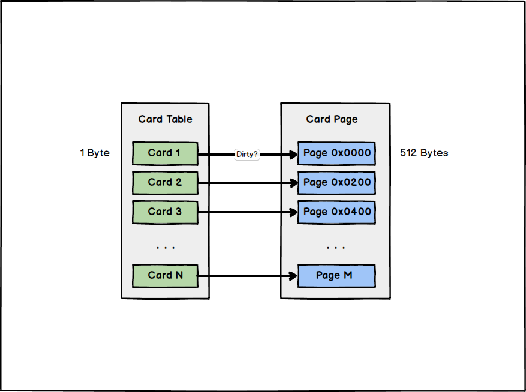

# HotSpot中的GC实现细节

这里从 *HotSpot-VM* 的实现介绍一些 **跨代引用** 和 **可达性分析** 中的优化手段。

| Implementation                                                                    | Purpose                                           |
| --------------------------------------------------------------------------------- | ------------------------------------------------- |
| [记忆集(Remembered-Set)/卡表(Card-Table)](#记忆集-remembered-set-卡表-card-table) | 跨代引用存在时, 缩减 GC-Roots 扫描范围            |
| [写屏障(Write-Barrier)](#写屏障-write-barrier)                                    | 解决已经 JIT编译 成机器码的指令如何更新卡表的问题 |
| [OopMap(Ordinary-Object-Pointer-Map)](#oopmap)                                    | 记忆栈上指向堆的引用, 加快根节点枚举, 减少 STW    |
| [安全点](#安全区-safe-region)                                                     | 减少 OopMap 更新的频率, 从而减少额外开销          |
| [安全区](#安全区-safe-region)                                                     | 解决挂起线程无法执行到安全点的问题                |

## 记忆集-Remembered-Set-卡表-Card-Table

垃圾收集器是针对特定划分的 **堆(*Heap*)** 区域来进行 *GC* 的, **记忆集(*Remembered-Set*)** 是用来解决 **跨代引用** 的问题的。

**记忆集(*Remembered-Set*)** 是一种用于记录从非收集区域指向收集区域的引用集合的抽象数据结构。

> **跨代引用**: 例如当准备收集新生代垃圾的时候, 由于可能存在由老年代指向新生代的引用, 因此必须对老年代进行扫描确认 *GC-Roots*。(*G1* 等全区域收集器则不需要考虑这个问题)

记录包含所有跨代引用的对象开销有一些大, 原因是记录的粒度过小, 从节约成本的角度考虑可以扩大粒度, 仅仅记忆某一块非收集区域的内存块中是否存在跨代引用即可。

**常见记忆集粒度:**

1. **字长精度**: 精确到机器字长，记录的字包含跨代指针。
2. **对象精度**: 精确到对象，记录的对象中包含跨代指针。
3. **卡精度**: 精确到一个内存区域，记录的内存区域中包含跨代指针。

> **Note**: 使用卡精度的记忆集也被称为卡表(Card-Table)。



> 一个 **卡页(*Card-Page*)** 内存中通常包含不止一个对象, 但只要其中包含跨代引用对象, 则称该页是 **脏(Dirty)** 的。
>
> *HotSpot-VM* 使用的 **卡页(*Card-Page*)** 大小是 *2^9 Bytes*, 即 *512 Bytes*。

## 写屏障-Write-Barrier

通过 [**记忆集(*Remembered-Set*)/卡表(*Card-Table*)**](#记忆集-remembered-set-卡表-card-table), 我们缩减了 *GC-Roots* 扫描的范围, 但卡表本身的维护是如何进行的?

在有其他分代区域中的对象指向了本区域的对象时, 就应该更新对应的 **卡表(*Card-Table*)** 项。对于解释执行的字节码, 解释器有充分的操作空间在指令前后插入更新操作, 但是对于已经 ***JIT*编译(*Just-In-Time Compilation*)** 成为机器码的指令, 只能从机器码的层面进行拦截并插入更新 **卡表(*Card-Table*)** 的操作, 这种手段就叫做 **写屏障(*Write-Barrier*)**。

**写屏障其实类似于对一条指令做 *AOP* 加强**, 在指令的的 前/后 进行额外操作。在 *G1* 出现之前, 其他收集器都只用到了写后屏障。以下是一段更新 **卡表(*Card-Table*)** 的简化逻辑:

```cpp
// Simplified logic of write-barrier.
void oop_field_store(oop* field, oop new_value) {
  *field = new value;                   // reference assignment
  post_write_barrier(field, new_value); // post-write barrier, update card table
}
```

## OopMap

**OopMap(Ordinary-Object-Pointer-Map)**, 其实就是一个用于 *GC* **根节点枚举**, 存放了 **栈(*Stack*)** 上哪些变量是指向 **堆上对象(*Object on
Heap*)** 的引用的表。该结构的存在减少了 **可达性分析(*Reachability-Analysis*)** 中根节点枚举的时间, 从而减少了 *STW* 的时间。

> 迄今为止, 所有的 **垃圾收集器(*Garbage-Collector*)** 在 **根节点枚举** 这一步上都 **必须** 暂停所有用户线程(*"Stop The World", STW*)。但查找引用链这一步已经可以做到和用户线程并发。所以 *OopMap* 的存在非常重要。

## 安全点-Safe-Point

[***OopMap***](#oopmap) 能够辅助根节点枚举高速的完成, 但是几乎每一条指令都有可能导致引用关系变化, 从而使得 *OopMap* 需要更新, 如果为每一条指令都生成对应的
*OopMap*, 开销将会大的无法接受。

所以 *HotSpot-VM* 其实并没有在每一条指令后都更新 *OopMap*, 而只在特定的位置记录并更新, 这些位置被称为 **安全点(Safe-Point)**。(但安全点的存在也导致了 *GC* 无法在任意位置开始, 所有的字节码必须运行到 *Safe-Point* 才能开始 *GC*, 否则无法保证一致性)

需要 *GC* 时用户线程何时暂停?

- 主动式中断-Voluntary-Suspension

  需要 GC 的时候, JVM 仅为线程设置一个标记位, 线程运行时会不断轮询这个标志位, 当线程自行发现标志位被设置为需要 GC 时候, 会运行到最近的安全点然后主动挂起。

  > 轮询对应标志位的操作是非常高频的, 要求非常高效。*HotSpot-VM* 采用内存保护陷阱, 将汇编指令压缩到 *1* 条。(轮询的内容是 *test* 某块地址的可读性, 不可读则自陷异常, 预注册好的逻辑就会完成后续工作。)

- ~~抢占式中断(Preemptive-Suspension)~~

  JVM 直接强制中断线程的执行, 一旦发现有线程还没有执行到安全点, 则回复其执行, 直至到达安全点。

  > 涉及到上下文切换, 开销很大, 所以现在的 *JVM* 实现很少采用这种方案。

## 安全区-Safe-Region

[**安全点(*Safe-Point*)**](#安全点-safe-point) 的机制仍然无法覆盖一部分场景, 即当线程处于 *Sleep* 或者 *Blocked* 的状态中, 这样的线程无法自行执行, 也就无法达到安全点。(*JVM* 也不可能无视用户逻辑恢复线程让他们运行到 *Safe-Point*)

因此 *HotSpot-VM* 提出了 **安全区(*Safe-Region*)** 的概念。**当线程处于安全区的时候必然不可能发生引用关系的改变**, 因此安全区内任意时刻对该线程发起 *GC* 都是安全的。**(可以看作是"拉长了"的安全点)**

用户线程进入安全区的时候会标识自己, 这样 *HotSpot-VM* 在执行 *GC* 的时候就不再对其判断是否在安全点了。当安全区内的线程需要恢复执行的时候, 会先查看根节点枚举是否完成, 是则恢复执行, 否则挂起等待结束后再恢复。(与根节点枚举的 *STW* 吻合)
