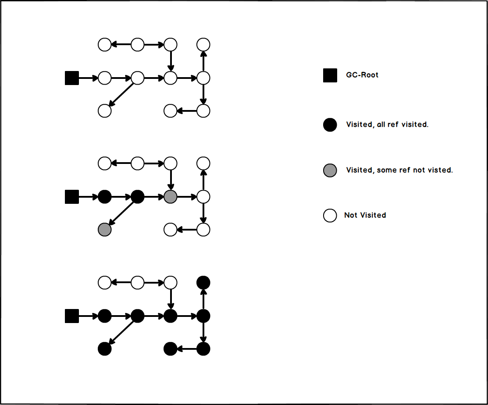
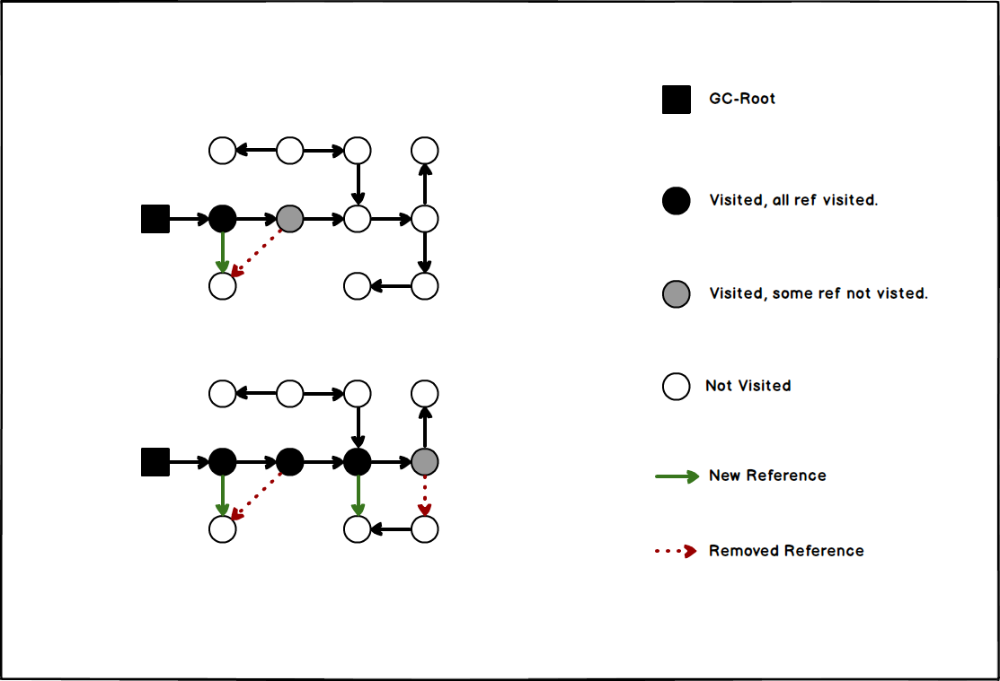

# 三色标记法-Tri-Color-Marking

目前所有 *GC* 在根节点枚举阶段都必须 *STW* 来防止引用被改变。但是顺着 *GC-Roots* 查找引用链的过程已经能够做到和用户并发。

**三色标记法(*Tri-Color-Marking*)** 用于完成与用户线程并发的引用链查找过程。

- [三色标记法-Tri-Color-Marking](#三色标记法-tri-color-marking)
  - [三色标记法的流程](#三色标记法的流程)
  - [扫描期间什么样的引用变化是不安全的](#扫描期间什么样的引用变化是不安全的)
  - [如何解决不安全的引用变化](#如何解决不安全的引用变化)

## 三色标记法的流程

首先说一下三种颜色的含义:

- 黑色代表已经完成扫描的对象, 其发出的所有引用都被遍历过了。
- 灰色代表正在扫描的对象, 其发出的引用有一部分还没有变遍历。
- 白色代表还没有扫描到的对象。

通过下面两个简单的例子初步理解一下三色标记法:

- 当查找引用链期间没有引用关系发生变化:

  可以想象灰色对象为波浪的前锋, 黑色的浪潮逐渐吞噬白色的过程。

  

  > 黑色对象是明确一定会存活的, 灰色对象是正在判断且尚不明确的, 黑色对象不可能直接指向白色对象。
  >
  > (也正是因为黑色对象明确一定会存活, 因此不会再重新扫描黑色对象)

- 当查找引用链过程中有引用关系发生变化:

  这个案例中, 有一个灰色到白色的引用被取消了, 随后又有一个黑色对象建立了对该白色对象的引用, 但被引用对象还是白色, 就会被 **"误回收"**。(黑色对象明确存活, 不会重新扫描其发出的引用)

  

## 扫描期间什么样的引用变化是不安全的

由上面的分析我们可以知道, 扫描期间有一些引用的变化可能导致致命的 **"误回收"** 问题, 那么什么条件才会引起不安全的引用变化?

*Wilson* 于 *1994* 年理论上证明了, **当且仅当** 以下两个条件 **同时满足** 的时候才会发生 **"误回收"**:

1. 赋值器插入了一条或多条从黑色对象到白色对象的新引用。
2. 赋值器删除了全部从灰色对象到该白色对象的直接或间接引用。

> "误回收" 是指回收了不该回收的对象, 是非常严重的错误。
>
> "浮动垃圾" 是指漏回收了一些本该被回收的对象, 在三色标记法中是容忍这种情况发生的, 因为它不像 "误回收" 那么严重, 逃过 GC 的垃圾在后几轮中也大概率会被回收掉。

## 如何解决不安全的引用变化

对应上面两个引发不安全引用变化的条件, 我们只需要破坏掉其中一个条件即可, 对应以下两种方案:

- **增量更新(Incremental-Update)**

  - 破坏的是第一个条件, "赋值器插入了一条或多条从黑色对象到白色对象的新引用"。
  - 当黑色对象创建指向白色对象的引用时, 将这个引用先记录下来, 等并发扫描结束之后重新扫描一遍刚刚记录的黑色对象发出的增量引用。
  - [***CMS***](GC-Collectors.md#cmsconcurrent-mark-sweep) 使用此方案。

- **原始快照(Snapshot-At-The-Beginning)**

  - 破坏的是第二个条件, "赋值器删除了全部从灰色对象到该白色对象的直接或间接引用"。
  - 当灰色对象删除指向白色对象引用的时候, 将原本发出这个被删除的引用的灰色节点记录下来, 等并发扫描结束之后重新扫描一遍刚刚记录的灰色对象发出的引用。
  - [***G1***](./GC-Collectors.md#g1garbage-first) / [***Shenandoah***](./GC-Collectors.md#shenandoah) 使用此方案。
