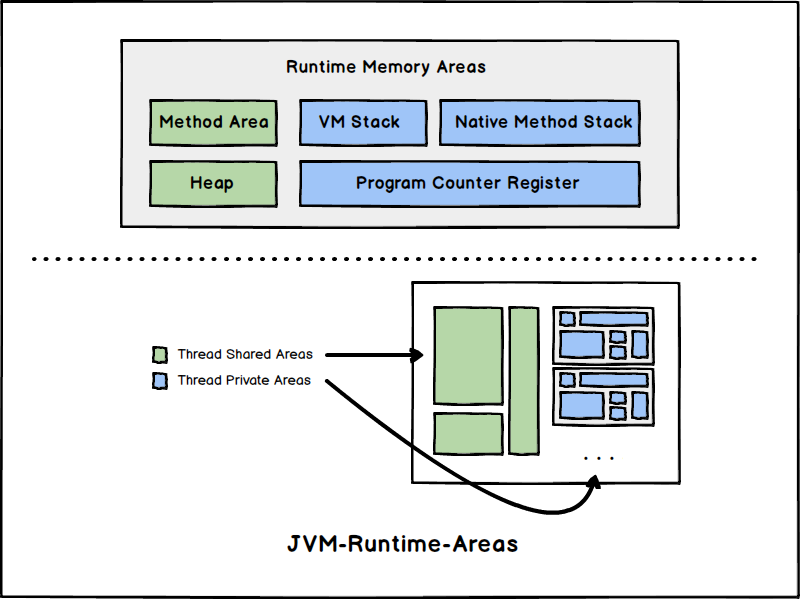
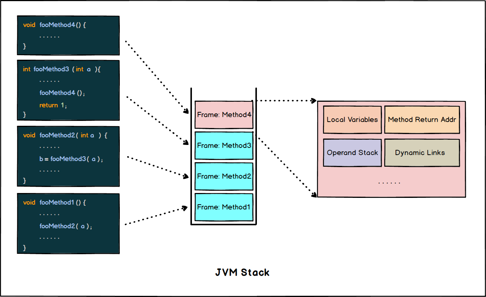

# JVM内存区域

以下为 JVM 中几块比较重要的运行时内存区域:

- **线程私有**:

  - [程序计数器(Program-Counter)](#程序计数器-program-counter)
  - [JVM栈(JVM-Stack)](#jvm栈-jvm-stack)
  - [本地方法栈(Native-Method-Stack)](#本地方法栈-native-stack)

- **线程共享**:
  - [JVM堆(JVM-Heap)](#jvm堆-jvm-heap)
  - [方法区(Method-Area)](#方法区-method-area)

## 程序计数器-Program-Counter

**程序计数器(*PC*)** 是一块较小的内存空间, 可以看作是 **当前线程执行字节码的位置指示器**。*JVM*
的字节码解释器通过维护这个计数器控制程序的控制流，如:

- 分支
- 循环
- 跳转
- 异常处理
- 线程恢复
- ...

程序计数器是 **线程私有** 的，因为每个线程都有自己 **独立的执行流**。

> 当执行 *JVM* 方法时, *PC* 中记录正在执行的 *JVM* 字节码指令地址。
> 而当执行 `native` 方法时候，*PC* 中的值为 **空(*Undefined*)**。

## JVM栈-JVM-Stack

**栈(*JVM-Stack*)** 也是 **线程私有** 的, 生命周期与线程相同。其描述的是 *JVM* 方法执行的线程内存模型, 每个 *JVM*方法 执行的时候都会同步创建一个 **栈帧(*Stack-Frame*)**, 其存储着:

- 局部变量表
- 操作数栈
- 动态链接
- 方法出口
- ...

> 栈帧在方法调用时进栈，执行结束时出栈。

栈帧中的局部变量表存放了各种编译期可知的信息:

- **基本数据类型**: `boolean`, `byte`, `char`, `short`, `int`, `long`, `float`, `double`
- **对象引用**: `reference`
- **返回地址**: 指向一条字节码指令的地址
- ...

这些数据类型在局部变量表中存储的空间以 *Slot* 来表示, *64bit* 的`long`和`double`占用 *2* 个  *Slot*, 其余都只占用 *1* 个 *Slot*。局部变量表占用的 *Slot* 数量在 **编译期确定**, 但每个 *Slot* 的大小和 *JVM* 的实现有关系(平台也有关)。

> 以上的 *Slot* 可以粗略理解为"字长", JVM 每次取址都和这个宽度相关, **位填充(*Padding*)** 也和这个宽度相关。

**关于溢出：**

- 线程请求的 *JVM-Stack* 深度大于 *JVM* 允许的深度, 抛出 `StackOverflowError`.
- 如果 *JVM-Stack* 容量允许动态扩展, 但无法申请到足够内存, 抛出 `OutOfMemoryError`(OOM)。

## 本地方法栈-Native-Stack

与 [***JVM-Stack***](#jvm栈-jvm-stack) 相似, 但只为 `native` 的方法服务, "*JVM*规范" 没有对这个区域做具体实现要求。

## JVM堆-JVM-Heap

**堆(*Heap*)** 是 *JVM* 所管理的内存中 **最大** 的也是 **最重要** 的一块区域, 每个 *JVM* 有且仅有一个堆, 由 **所有线程共享** 。**堆(*Heap*)** 唯一的作用就是存放对象实例, *JVM* 启动的时候就会创建。

***JVM*堆** 可以处于物理不连续的内存上, 但 **逻辑上应该视为一片连续的内存**。***JVM*堆** 大小可以是固定的也可以是可变的, 现存的实现大多数实现都是可扩展的。(仅在分配内存失败且 *Heap* 扩容失败时才会抛出 *OOM(Out-Of-Memory)*)

**堆(*Heap*)** 由 [**垃圾收集器(*Garbage-Collector*)**](./GC-Collectors.md) 进行内存管理。

> "*JVM*规范" 中指明, 所有的对象实例以及数组都应该在 *Heap* 上分配, 但随着 *Valhalla* 等项目的推进, 日后可能出现更多 **值类型** 的支持, 以及编译时的逃逸分析等优化技术的应用(栈上分配), "所有实例都在堆上分配" 的说法可能会变得越来越没有那么绝对。

## 方法区-Method-Area

**方法区** 也由 **所有线程所共享**。用于存储包括但不限于：

- *JVM* 加载的类型信息
- 常量(*Constants*)
- 静态变量(*Static-Variables*)
- *JIT* 编译后的代码缓存数据

> 不要将 **方法区** 和 **永久代** 混淆, **JDK8** 之前方法区用永久代实现, 之后的方法区在通过 **Native-Memory** 实现的 *Meta-Space* 中。
>
> "*JVM*规范"对方法区的约束很宽松, 和 **[*JVM*堆](#jvm堆-jvm-heap)** 一样不要求连续内存, 大小是否固定也是可选的, 甚至可以不实现垃圾收集。(但方法区中的东西并非永远不需要清理, 常量池和类型也需要卸载, 否则会有内存泄漏)
