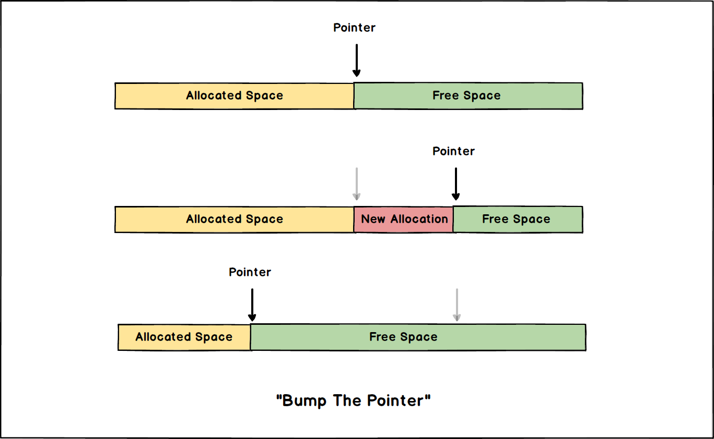
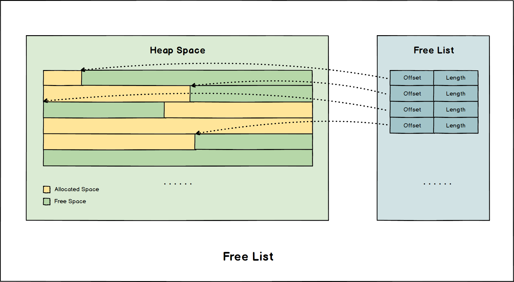
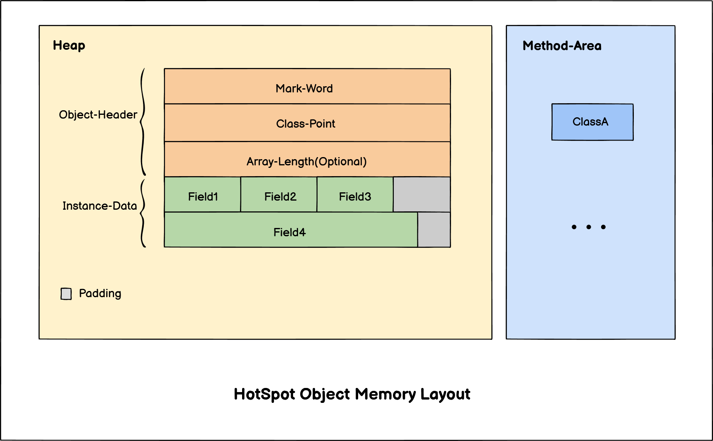
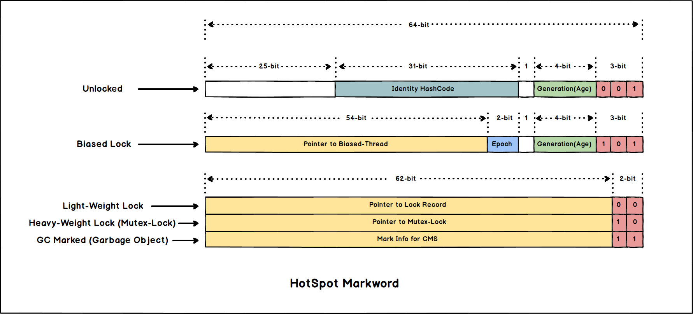
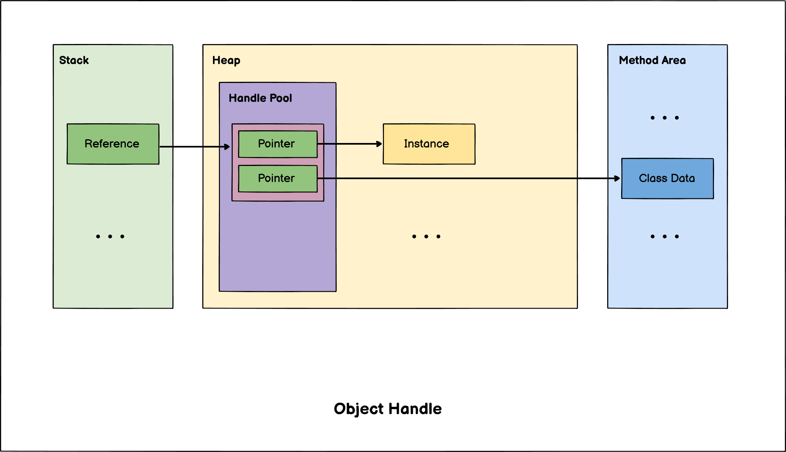
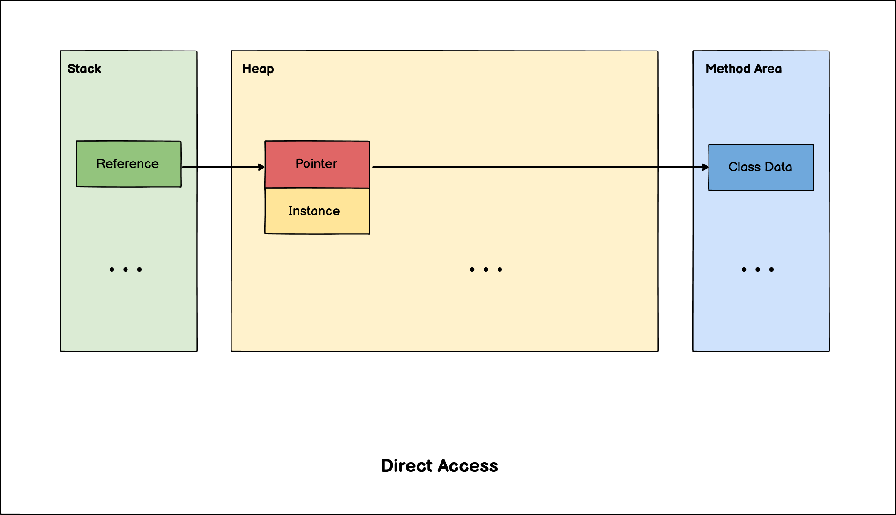

# JVM对象-JVM-Object

以 *HotSpot-VM* 为例介绍 ***JVM*对象** 的分配, 布局和访问方式。

> 以下所有介绍都是基于 *HotSpot-VM* 的实现, 并非所有 *JVM* 实现都适用。

- [JVM对象-JVM-Object](#jvm对象-jvm-object)
  - [对象创建-内存分配](#对象创建-内存分配)
    - [指针碰撞-Bump-The-Pointer](#指针碰撞-bump-the-pointer)
    - [空闲列表-Free-List](#空闲列表-free-list)
    - [本地线程分配缓冲-Thread-Local-Allocation-Buffer-TLAB](#本地线程分配缓冲-thread-local-allocation-buffer-tlab)
  - [对象内存布局](#对象内存布局)
    - [Mark-Word](#mark-word)
  - [对象的访问](#对象的访问)
    - [对象句柄-Object-Handle](#对象句柄-object-handle)
    - [直接指针-Direct-Access](#直接指针-direct-access)

## 对象创建-内存分配

当 ***JVM*字节码解释器** 遇到对象创建指令的时候, 会先检查常量池中是否有对应类的符号引用, 然后检查对应的类是否被加载(若未加载则先执行相应的加载过程)。类加载检查通过后就会为新生的对象分配内存。

内存的分配大致上能够分为以下几种方式:

### 指针碰撞-Bump-The-Pointer

对象所需内存的大小在类加载完成后便可完全确定, 为对象分配空间的任务等同于把一块确定大小的内存从 ***JVM*堆** 中划分出来。假设 ***JVM*堆** 中内存是绝对规整的, 所有用过的内存都放在一边, 空闲的内存放在另一边, 中间放着一个指针作为分界点的指示器, 那所分配内存就仅仅是把那个指针向空闲空间那边挪动一段与对象大小相等的距离, 这种分配方式称为 **指针碰撞**。

### 空闲列表-Free-List

如果 ***JVM*堆** 内存中的内存并不是规整的, 已被使用的内存和空闲的内存相互交错在一起, 那么就不能够使用 [**指针碰撞**](#指针碰撞-bump-the-pointer) 了, 虚拟机必须维护一个列表来记录哪些内存是可用的, 在分配的时候从列表找到一块大的空间分配给对象实例, 并更新列表上的记录, 这种分配方式就是 **空闲列表(*Free-List*)**。

### 本地线程分配缓冲-Thread-Local-Allocation-Buffer-TLAB

问题: 内存分配的线程安全吗, 如何保证?

- 既然 ***JVM*堆** 由所有线程共享, 那么就有可能有多个线程同时申请内存, 显然可能存在线程安全问题。(对内存分配的元数据读写存在竞争)
- *HotSpot-VM* 采用 ***CAS* + 失败重试** 保证线程安全

但是对于整个堆进行同步的方案在开销上不够乐观, **HotSpot-VM** 为每个线程划分缓冲区, 称为 **本地线程分配缓冲(*Thread Local Allocation Buffer, TLAB*)**, 线程只在自己独享的缓冲区中进行分配, 只有缓冲区满了才会同步锁定然后分配新的缓冲区(大大减少了竞争发生的可能性)。同时对申请到的内存区域进行初始化(置零)的操作也可以顺带在申请 *TLAB* 的时候进行。

> 在 *TLAB* 缓冲区内部使用更高效的 [指针碰撞](#指针碰撞-bump-the-pointer)。

## 对象内存布局

*HotSpot-VM* 对象在 **堆(*Heap*)** 上的内存布局:

- **Header**
  - **Mark-Word**: 存放一些 *JVM* 使用的元数据。
  - **Class-Pointer**: 指向对应 `Class` 对象的指针。
  - **Array-Length**: 可空, 当对象为数组时使用。
- **Instance-Data**: 实例数据。
- **Padding**: 对齐填充。

### Mark-Word

*Mark-Word* 用于存储对象运行时所需要的一些元数据, 考虑到效率问题, *HotSpot-VM* 中的 *Mark-Word* 被设计成根据不同情况有不同语义的一块动态的连续内存, 其中包含的具体信息如下图所示。

## 对象的访问

*JVM* 程序 通过 **栈(*Stack*)** 上的引用访问 **堆(*Heap*)** 上的对象。

> HotSpot-VM 主要采取 [直接指针](#直接指针-direct-access) 的方式, 因为能够减少一次指针寻址的开销。但也有例外情况, 使用 Shenandoah 收集器的时候会有一次额外的转发。

### 对象句柄-Object-Handle

对象句柄的方式 **堆(*Heap*)** 内存中单独划分出一块 **句柄池(*Handle Pool*)**, 其中包含实例数据的地址以及类型数据的地址。

> 这种方式的好处是 引用(*Reference*) 指向的是一个稳定的地址, 对象被移动时无需更改引用。

### 直接指针-Direct-Access

在直接指针的访问模式下, **引用(*Reference*)** 直接指向 **堆(*Heap*)** 中的实例数据。

> 这种方式的好处是减少了一次寻址开销, 但必须考虑如何访问对象的类型信息。
