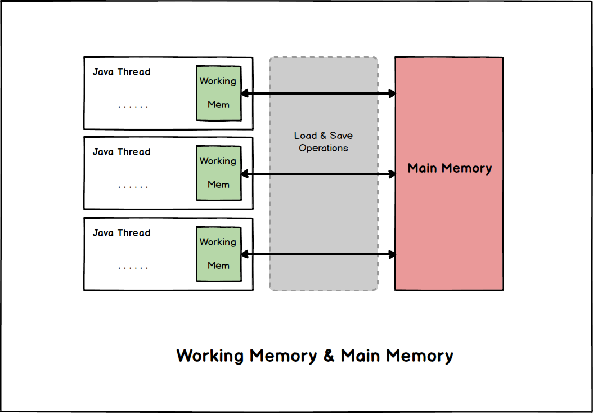
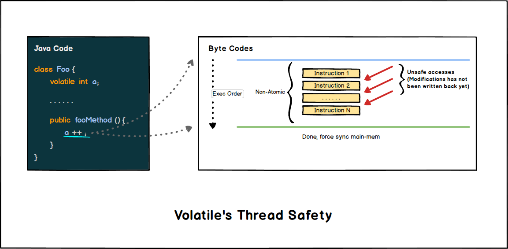

# Volatile

***"Volatile"*** 意为 "易变的", `volatile` 修饰的变量能够保证 **可见性**。

> `volatile` 保证可见性但 **不保证原子性**。

- [Volatile](#volatile)
  - [主内存和工作内存](#主内存和工作内存)
  - [Volatile的工作机制](#volatile的工作机制)
  - [关于可见性](#关于可见性)
  - [Volatile与线程安全](#volatile与线程安全)

## 主内存和工作内存

***JMM(Java-Memory-Model)*** 规定所有的变量都会存储在 **主内存(*Main-Memory*)** 中, 但每个线程都拥有自己的 **工作内存(*Working-Memory*)**, 其中 **缓存** 了线程使用的变量的 **副本**, 线程只能直接操作工作内存, **禁止直接读写主内存**。

> 出于性能考量, *Main-Memory* 一般对应着物理内存, 而 *Working-Memory* 会被安排到 *寄存器* 或 *Cache* 上。

## Volatile的工作机制

- `volatile` 对于可见性的保证来源于:
  
  *JVM* 会在对 `volatile` 修饰的变量上进行操作的任何语句做一个"强化", 任何对于该变量的操作结束后 **强制** 把值同步回 **主内存(*Main-Memory*)**。

- `volatile` 的第二个语义:

  禁止编译器进行指令重排序优化。

## 关于可见性

***Volatile*的可见性问题**: 很多语句在字节码层面并不是原子的, 内部存在很多"缝隙", 在这些"缝隙"间线程可以被切换, 其他线程可以在操作尚未完成时读取到值。

`volatile` 虽然保证单条字节码操作的 **可见性**, 但最基本的操作哪怕是简单的运算符, 在 *JVM* 中都 **无法保证其对应的字节码执行是原子的**。所以在这些非原子操作的 "缝隙" 中, 其他线程看到的并非程序员所期望其他线程看到的 "最终结果"。

## Volatile与线程安全

那么什么时候才能说 `volatile` 是线程安全的呢?

| Condition                    | Reason                                                                                |
| ---------------------------- | ------------------------------------------------------------------------------------- |
| 计算操作不依赖变量之前的值   | 简单的 set / get 操作是原子的(不存在"缝隙"), 操作完成后强制回写主内存, 能够保证可见性 |
| 变量不与其他变量共同参与约束 | 无法保证两个 `volatile` 变量回写过程没有 "缝隙"                                       |

> 注意在一些 *JVM* 的 *32bit* 实现中, *64bit* 的变量操作不能保证原子性。
>
> *64bit* 的类型主要是指 `long` 和 `double`
