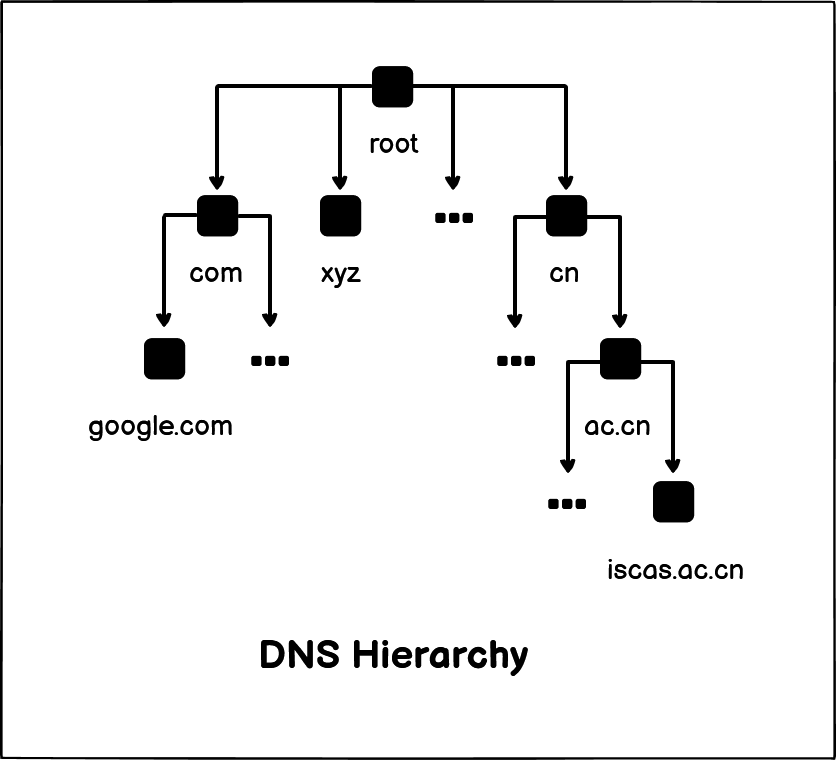
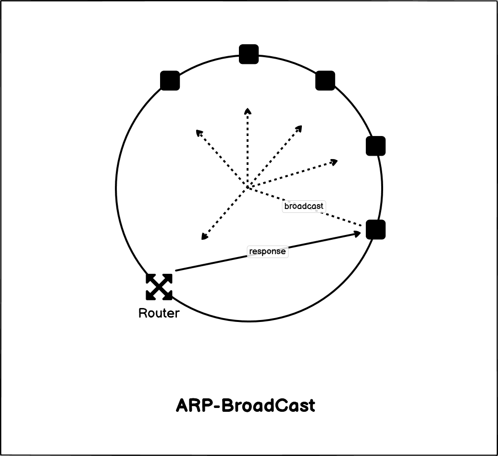

# 从输入网址到浏览器显示网页, 期间发生了什么?

- [从输入网址到浏览器显示网页, 期间发生了什么?](#从输入网址到浏览器显示网页-期间发生了什么)
  - [1-HTTP](#1-http)
  - [2-DNS](#2-dns)
  - [3-TCP](#3-tcp)
  - [4-IP](#4-ip)
  - [5-MAC](#5-mac)
  - [6-Network-Card](#6-network-card)

## 1-HTTP

浏览器做的第一步事情是解析地址栏中输入的 *URL*, 构造发送给 *Web-Server* 的 *HTTP-Request*。

**URL** 的结构:

```text
http:  // www.some-server.com  /  dir-name / ... / file-name
~~~~~     ~~~~~~~~~~~~~~~~~~~     ~~~~~~~~~~~~~~~~~~~~~~~~~~~
^         ^                       ^
Scheme    Server Name             Resource Path
```

浏览器会根据 *URL* 构造一个 *HTTP* 请求, 通常是 `GET` 请求:

```http
GET /dir-name/.../file-name HTTP/1.1
Accept: */*
````

## 2-DNS

浏览器拿到 *URL* 并解析之后, 会使用 *OS* 中的协议栈将上一步中构造好的 *HTTP-Request* 发送到目标主机。

但是我们知道 *TCP/IP* 协议栈需要根据 *IP* 地址来将报文发送到远程网络上的机器, 如何获得 **域名(Domain)** 和 **IP地址** 之间的映射呢? 这里就需要使用 **DNS(Domain-Name-System)** 了。

DNS 中域名通过 `.` 分割, 如 `iscas.ac.cn`, 越 **右** 层级越 **高**。



域名解析流程:

```text
浏览器缓存 -> OS缓存 -> HOSTS文件 -> 本地DNS服务器 -> ... -> 根DNS服务器
                                   ~~~~~~~~~~~~~~~~~~~~~~~~~~~~~~~~~~
                                   ^
                                   DNS Servers
```

**"只指路不带路"**: 低级别的DNS服务器未命中后会给出其上级DNS服务器的地址, 主机自己去查询上级的服务器, 而非低级服务器去询问高级服务器。

> *DNS* 使用 *53* 端口, 基于 *UDP*。

## 3-TCP

解析完成之后通过操作系统协议栈中的 *TCP* 实现完成端到端传输, 将 *HTTP* 报文可靠传输到服务器的对应端口:

- *HTTP*: *80*
- *HTTPS*: *443*

## 4-IP

之后 *TCP* 报文交由操作系统协议栈中的 *IP* 层实现, 根据 [*DNS*](#2-dns) 解析的 *IP* 地址发送报文。

## 5-MAC

[*IP*](#4-ip) 报文进入数据链路层完成局域网内部的传输, 但是局域网内部通过 *MAC* 地址完成传输, 那么只有 *IP* 地址信息的报文如何知道被发送到哪一台机器?

这里就需要使用 *ARP(Address-Resolution-Protocol)* 来完成 *IP* 地址到 *MAC* 地址的映射。

*ARP* 在以太网内部通过 **广播** 的方式寻找目标机器, 目标机器收到 *ARP* 报文之后会回复一条报文, 告知请求者自己的 *IP* 地址。



## 6-Network-Card

网卡设备将 *MAC* 报文编码成 **帧**(*Frame*), 并在末尾加上校验序列, 然后转换成电信号, 送上网线。
