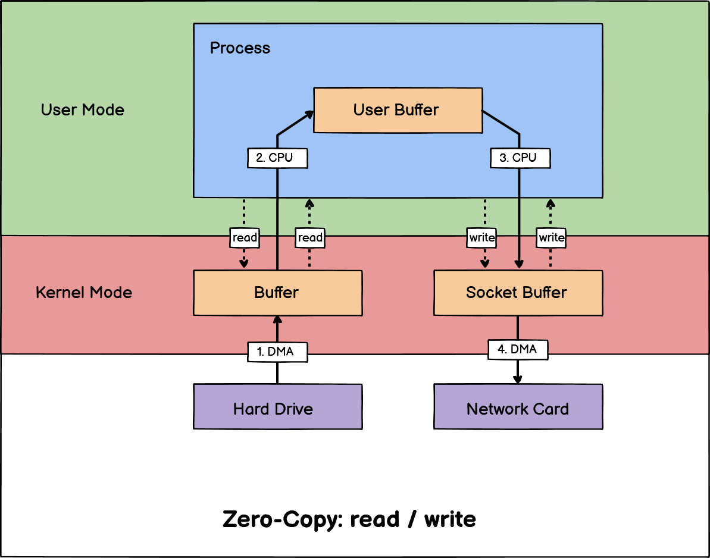
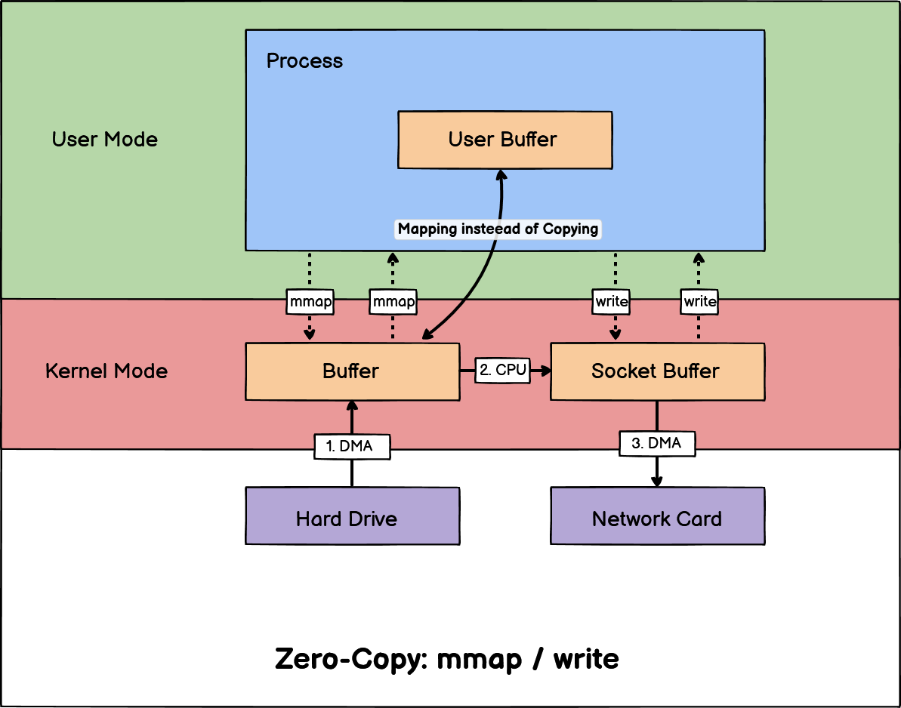
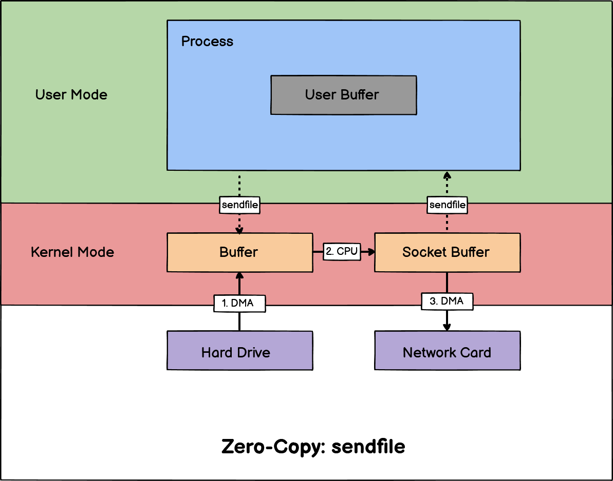
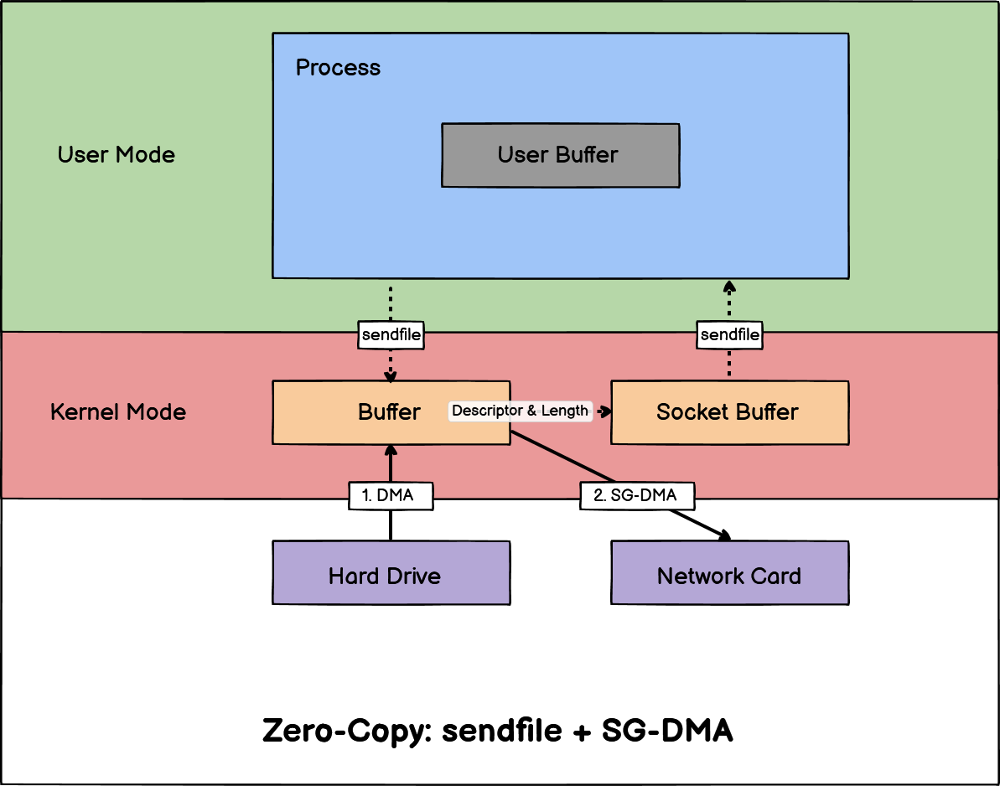

# 操作系统中的零拷贝-Zero-Copy

要想提高文件传输的性能, 就需要减少 **「用户态与内核态的上下文切换」** 和 **「内存拷贝」** 的次数。

> 尤其是 *CPU* 参与的拷贝, *DMA* 拷贝能够提升部分性能。

- [操作系统中的零拷贝-Zero-Copy](#操作系统中的零拷贝-zero-copy)
  - [传统的文件传输-Read-Write](#传统的文件传输-read-write)
  - [如何优化文件传输](#如何优化文件传输)
  - [Linux下如何实现零拷贝](#linux下如何实现零拷贝)
    - [Mmap-Write](#mmap-write)
    - [Sendfile](#sendfile)
    - [SG-DMA](#sg-dma)

## 传统的文件传输-Read-Write

如果服务端要提供文件传输的功能, 我们能想到的最简单的方式是：将磁盘上的文件读取出来, 然后通过网络协议发送给客户端。

传统 **I/O** 的工作方式是, 数据读取和写入是从用户空间到内核空间来回复制, 而内核空间的数据是通过操作系统层面的 **I/O** 接口从磁盘读取或写入。

代码通常如下, 一般会需要两个系统调用：

```c
read(file, tmp_buf, len);
write(socket, tmp_buf, len);
```



注意以上的流程中发生了 ***4* 次上下文切换**, ***2* 次 *CPU* 拷贝**。

## 如何优化文件传输

主要有以下两个优化点:

- *OS* **上下文切换** 的次数
  
  减少系统调用的次数。(需要 *OS* 提供更加高级的接口)

- **内存拷贝** 发生的次数

  因为文件传输的应用场景中, 在用户空间我们并不会对数据 **「再加工」**, 所以数据实际上可以不用搬运到用户空间, 因此 **用户的缓冲区是没有必要存在的**。

## Linux下如何实现零拷贝

以下介绍几种 *Linux* 操作系统下实现 **零拷贝** 的方案。

### Mmap-Write

`mmap()` 系统调用函数会直接把内核缓冲区里的数据 **「映射」** 到用户空间, 这样操作系统内核与用户空间就不需要再进行任何的数据拷贝操作。

在前面我们知道, `read()` 系统调用的过程中会把内核缓冲区的数据拷贝到用户的缓冲区里, 于是为了减少这一步开销, 我们可以用 `mmap()` 替换 `read()` 系统调用函数。

```c
buf = mmap(file, len);
write(sockfd, buf, len);
```



> 这样我们减少了一次 CPU 参与的拷贝, 提升了一部分效率, 但显然这还不是最终形态的 **零拷贝**。

### Sendfile

在 *Linux* 内核版本 *2.1* 中, 提供了一个专门发送文件的系统调用函数 `sendfile()`, 函数形式如下：

```c
#include <sys/socket.h>
ssize_t sendfile(int out_fd, int in_fd, off_t *offset, size_t count);
```

它的前两个参数分别是目的端和源端的文件描述符, 后面两个参数是源端的偏移量和复制数据的长度, 返回值是实际复制数据的长度。

- 首先, 它可以替代前面的 `read()` 和 `write()` 这两个系统调用, 这样就可以减少一次系统调用, 也就减少了 *2* 次上下文切换的开销。

- 其次, 该系统调用, 可以直接把内核缓冲区里的数据拷贝到 *socket* 缓冲区里, 不再拷贝到用户态, 这样就只有 *2* 次上下文切换, 和 *3* 次数据拷贝。



> 但是这仍然不是真正的零拷贝技术, 如果网卡支持 *SG-DMA(The Scatter-Gather Direct Memory Access)* 技术, 我们可以进一步减少通过 *CPU* 把内核缓冲区里的数据拷贝到 *socket* 缓冲区的过程。

### SG-DMA

你可以在你的 *Linux* 系统通过下面这个命令, 查看网卡是否支持 *scatter-gather* 特性：

```bash
ethtool -k eth0 | grep scatter-gather
```

于是, 从 *Linux* 内核 *2.4* 版本开始起, 对于支持网卡支持 *SG-DMA* 技术的情况下, `sendfile()` 系统调用的过程发生了变化, 具体过程如下：

1. 通过 *DMA* 将磁盘上的数据拷贝到内核缓冲区。
2. 缓冲区描述符和数据长度传到 *socket* 缓冲区, 这样网卡的 *SG-DMA* 控制器就可以直接将内核缓存中的数据拷贝到网卡的缓冲区里, 此过程不需要将数据从操作系统内核缓冲区拷贝到 *socket* 缓冲区中, 这样就减少了一次数据拷贝。

所以这个过程之中, 仅仅进行了 *2* 次数据拷贝。



这就是所谓的 **零拷贝(*Zero-copy*)** 技术, 因为我们没有在内存层面去拷贝数据, 也就是说全程没有通过 *CPU* 来搬运数据, 所有的数据都是通过 *DMA* 来进行传输的。。

零拷贝技术的文件传输方式相比传统文件传输的方式, 减少了 *2* 次上下文切换和数据拷贝次数, 且仅需要 *2* 次上下文切换和数据拷贝次数, 就可以完成文件的传输。而且这 *2* 次的数据拷贝过程都不需要通过 *CPU* 进行, 都是由 *DMA* 来搬运。

> 总体来看, 零拷贝技术可以把文件传输的性能提高至少一倍以上。
