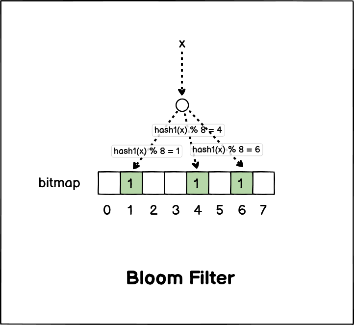

# 布隆过滤器-Bloom-Filter

**布隆过滤器(*Bloom-Filter*)** 由 **「初始值都为 0 的位图数组」** 和 **「 *N* 个不同的哈希函数」** 两部分组成。当我们在写入数据库数据时, 可以在布隆过滤器里做个标记, 下次查询数据是否在数据库前先查询布隆过滤器, 如果查询到数据没有被标记, 说明不在数据库中, 则可以避免查询数据库。

## 工作流程

布隆过滤器主要工作流程有以下 *3* 个步骤:

1. 使用 *N* 个不同的哈希函数分别对输入数据做散列, 得到 *N* 个 ***Hash*值**。
2. 将上面的得到的 ***Hash*值** 对位图数组 **长度取模**, 计算出对应下标。
3. 将位图数组对应下标的位置 *1*。

## 什么场景下不准确

在数据库写入数据 *x* 后, 把数据 *x* 标记在布隆过滤器时, 数据 *x* 会被 *3* 个哈希函数分别计算出 *3* 个哈希值, 然后再分别对这 *3* 个哈希值对 *8* 取模, 假设取模的结果为 *1*, *4*, *6*, 那么就把把位图数组的第 *1*, *4*, *6* 位置的值设置为 *1*。当应用要查询数据 *x* 是否存在于数据库中时, 只要通过布隆过滤器查询位图数组的第 *1*, *4*, *6* 位置的值是否全为 *1*, 只要有一个为 *0* 就可以认为数据 *x* 不在数据库中。

布隆过滤器由于是基于哈希函数实现实现的, 查找虽然高效, 但是存在哈希冲突的可能性。比如数据 *x* 和数据 *y* 可能都被散列到第 *1*, *4*, *6* 位上, 而事实上数据库中只存在 *x* 不存在 *y*, 这种情况布隆过滤器就会误判 *y* 存在。

所以, 布隆过滤器说数据存在, 并不一定证明数据库中存在这个数据, 但相反, 如果查询到数据不存在于布隆过滤器中, 则数据库中一定不存在这个数据。

> 断言 "不存在" 保真, 断言 "存在" 不保真。
